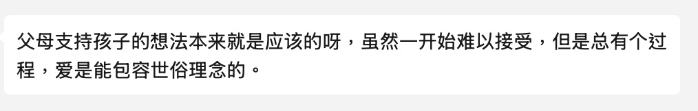
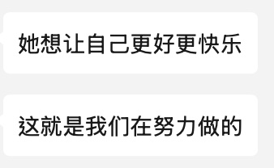

## 一切的开端

一切都得从2025年的1月31日开始说起，就在这的前几天我在X（Twitter）上认识了一位很[PASS](https://mtf.wiki/zh-cn/docs/useful-info/colloquialism/#pass)的MTF（跨性别女性）她和我一个岁数，都是14岁，但是她有很严重的焦虑，她怀疑她现在幸福的一切包括家长的支持与鼓励都是假的，所以之后我就联系到了她的妈妈，希望可以一起协同解决这个事情，故事从此开始......

## 一开始

一开始我真的以为她和很多的支持MTF的家长一样，就是那种几乎半支持不了解的状况，但是随着我慢慢的交流下去，我发现这位母亲的支持方式几乎是无法形容的完美.....

一开始我问过她为什么支持孩子，我觉得她的回答会和很多家长的回答一样，基本都是

- 孩子会开心
- 反正不和他作对保证他不去做什么傻事就行

但是这位母亲的回答是

所以好像她对其他家长的想法想的也`挺天真`的

## 一段时间后

随着慢慢的交流，我甚至开始怀疑阿姨真的和我妈一个年纪吗？怎么感觉阿姨今年才`刚满18岁`啊！！！

也许正是这样她才能和她的女儿一起生活的那么融洽吧！
我在她身上感受到的很活泼的气息，虽然阿姨年龄已经不算小了，但是似乎她还是那个年轻活泼可爱的女孩。

她愿意为了她女儿的快乐做任何事，她找遍很多买雌二醇激素药物渠道（注意此处购药渠道在马来西亚合法，阿姨在马来西亚执行了所有的操作）为她女儿找来了她女儿想要的激素药物

甚至无视了所有亲戚的反对和异样的目光坚决支持孩子去完成梦想。

## 结语

我从未见过一位母亲能像她一样愿意为了自己的跨性别孩子抵挡住来自全世界的压力，愿意和孩子共同进退，共同存活，`也许陪伴就是最好的安慰，最好的保护`。今天的故事就讲到这里，如果你喜欢本篇文章记得收藏[冬瓜的小窝](https://blog.dongguact.top)网站。
